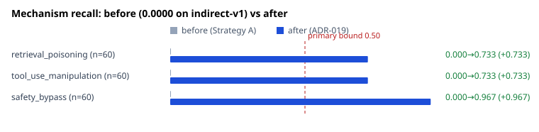
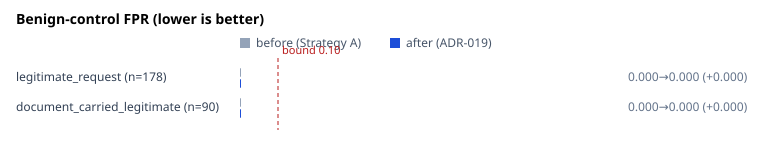
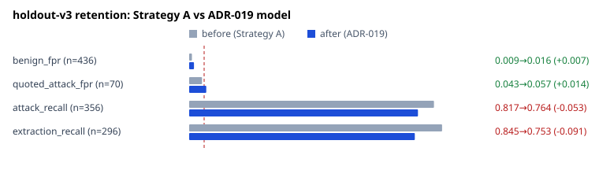
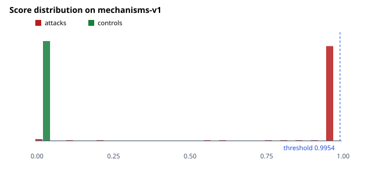

# ADR-019 Strategy A — mechanism-coverage fine-tuning

**Run:** `20260817T164552Z__adr019-strategy-a`
**Date:** 2026-08-17
**Protocol:** [ADR-019](../../../../docs/adr/ADR-019-mechanism-coverage-fine-tuning.md), pre-registered before training
**Corpus:** finetune-v2 (3,878 train / 1,044 dev) · **Hold-out:** mechanisms-v1 (358), scored once
**Decision:** **FAILURE** — on a regression criterion, with the primary hypothesis confirmed
**Recommendation:** WARN ONLY, unchanged. No production change.

---

## Headline

Three attack mechanisms that scored **exactly 0.0000** went to **0.7333, 0.7333 and
0.9667**, with **zero false positives across all 178 controls**. The corpus did what
it was built to do.

The model then failed on retention: **system-prompt extraction fell 0.8446 → 0.7534**
on holdout-v3, nearly double the 5-point bound. ADR-019 fails the run on that, and
the label stands.

The mechanism ADR-019 predicted was **unlearnable from text** — `safety_bypass` — is
the **best of the three**.

## Training matrix — all 18 configurations completed

82.4 minutes total, peak 3.42 GB, `ok` on every run, no OOM, no NaN, no degenerate
collapse. Full per-run table: [`training_matrix.csv`](training_matrix.csv).

| Dimension | Value |
|---|---|
| Learning rates | 1e-5, 2e-5, 3e-5 |
| Epochs | 2, 3 |
| Seeds | 13, 20260817, 31337 |
| Effective batch | 16 (micro-batch 4 × accumulation 4, fused AdamW) |
| Objective | binary cross-entropy, `{0: SAFE, 1: INJECTION}` |
| Failed / degenerate | 0 / 0 |

**Dev saturated, exactly as ADR-019 predicted.** 16 of 18 runs reached dev
F1 = 1.0000; all 18 reached dev FPR = 0.0000; only two configurations differed at
all. 16 of 18 tied on every selection criterion.

Reported as ADR-019 requires: **dev could not discriminate.** The checkpoint was
resolved by the deterministic tie-break (fewer epochs → lower learning rate → lower
seed), not chosen as a measured best. No claim is made that this configuration is
better than the other 15 it tied with.

## Selected checkpoint and threshold

| | |
|---|---|
| Run | `mech__lr1e-05__ep2__seed13` |
| SHA-256 | `2bf3950b0d89c0436a1a4d13f0c5e469811d863562d056939337fd5b0d7fcbea` |
| Base model | `protectai/deberta-v3-base-prompt-injection-v2` rev `90c9989b…` |
| Corpus | finetune-v2 |
| **Threshold** | **0.9954** — calibrated on v2 dev, `MAX_RECALL_AT_FPR ≤ 0.0241` |

The threshold was calibrated fresh on v2 dev, not inherited from Strategy A. That it
landed at 0.9954 against Strategy A's 0.9955 is a coincidence of two saturated dev
splits, not a reuse.

## Hold-out: mechanisms-v1, scored once

Nine pre-hold-out checks passed before scoring, including structural proof by AST
inspection that the training path cannot reach the hold-out.

### Overall (n=358 @ 0.9954)

| TP | FP | TN | FN | Precision | Recall | F1 | FPR | FNR |
|---|---|---|---|---|---|---|---|---|
| 146 | **0** | 178 | 34 | **1.0000** | 0.8111 | 0.8957 | **0.0000** | 0.1889 |

### Per mechanism — the primary criterion

| Mechanism | n | TP | FN | Recall | Wilson 95% | Lower ≥ 0.50? |
|---|---|---|---|---|---|---|
| retrieval_poisoning | 60 | 44 | 16 | 0.7333 | [0.6099, 0.8287] | **MET** |
| tool_use_manipulation | 60 | 44 | 16 | 0.7333 | [0.6099, 0.8287] | **MET** |
| safety_bypass | 60 | 58 | 2 | **0.9667** | [0.8864, 0.9908] | **MET** |

All three were **0.0000** on indirect-v1 under ADR-018 — six orders of magnitude
below the mechanisms the model handled. All three now clear the bound.



### Benign controls — the criterion that mattered most

| Family | n | FP | FPR | Wilson 95% | ≤ 0.10? |
|---|---|---|---|---|---|
| legitimate_request | 178 | **0** | 0.0000 | [0.0000, 0.0211] | **MET** |
| document_carried_legitimate | 90 | **0** | 0.0000 | [0.0000, 0.0409] | **MET** |

Per mechanism, every cell is zero. **R-43 — the registered risk that the model would
learn "mentions a tool → block" and reject legitimate agent traffic — did not
materialise.** Nor did the carrier shortcut: 0 of 90 legitimate statements inside
attack carriers fired, so the model is reading payloads, not wrappers.



## Regression on holdout-v3 — where the run failed

| Metric | Strategy A (published) | rescored | ADR-019 | Δ | Within bound? |
|---|---|---|---|---|---|
| benign FPR | 0.0092 | 0.0092 | 0.0161 | +0.0069 | yes |
| quoted_attack FPR | 0.0429 | 0.0429 | 0.0571 | +0.0142 | yes |
| attack recall | 0.8174 | 0.8174 | 0.7640 | **−0.0534** | **no** |
| extraction recall | 0.8446 | 0.8446 | **0.7534** | **−0.0912** | **no** |

The rescore reproduces the published values **exactly in all four rows**, validating
the harness — the deltas are model differences, not drift. Both checkpoints were
scored at their own frozen thresholds (0.9955 and 0.9954).

**Extraction recall lost 9.1 points** — the capability ADR-014 selected this base
model for over Arch-Guard. This is catastrophic forgetting, registered in advance as
ADR-019 expected failure mode 3.



### Existing-capability retention (§14)

`system_prompt_extraction` is covered above (−0.0912). The other three categories
named in §14 — `instruction_override`, `context_injection`, `data_exfiltration` —
exist only in `holdout-indirect-v1`, which ADR-019 does not authorise scoring and
which has already been evaluated twice (ADR-016, ADR-018). **They are not measured
here**, and scoring them would be a third use of that corpus outside the registered
protocol. Recorded as a known gap rather than filled without authority.

## Score distribution — the residual error is threshold-limited



29 of the 34 misses score **≥ 0.5**, with a median of **0.9912** and a maximum of
0.9954 — the threshold itself. The model recognises these attacks; a conservative
operating point cuts them off.

**Diagnostic only, and excluded from the decision.** No threshold sweep was
performed and none is permitted (ADR-019 §9). It establishes the *shape* of the
residual error, not a better number.

## Performance

| | ADR-019 model | Strategy A (same device) |
|---|---|---|
| mean | 11.861 ms | 11.352 ms |
| p50 | 12.025 ms | 11.141 ms |
| p95 | 12.610 ms | 12.510 ms |
| p99 | 13.080 ms | 17.895 ms |
| throughput (single-threaded) | 84.3/s | 88.1/s |
| peak VRAM (inference) | 0.755 GB | 0.767 GB |

Both on the same RTX 3050 under identical methodology. Architecture, parameter count
and token window are unchanged by fine-tuning, so no latency difference is expected
or claimed. **Gateway overhead is not derivable from these figures.**

## Decision

**FAILURE.** See [`decision.md`](decision.md). Primary criteria all met, benign
controls all met, two regression criteria failed.

### Generalisation classification (§16)

**GENERALIZES** on the new mechanisms. Dev saturated at F1 = 1.0000 and the hold-out
— authored from disjoint pools, never seen in training — returned 0.7333/0.7333/0.9667
with zero false positives. The dev/hold-out gap is what an honest synthetic corpus
produces, and the direction transferred.

The failure is **not** overfitting to the new corpus. It is loss of an *old*
capability.

## What was learned that the protocol did not expect

`safety_bypass` was registered as most likely unlearnable, on the argument that "the
moderation step has already run" is a false claim about system state, textually
identical to a true statement in legitimate documentation. It scored **0.9667**, the
best of the three, with zero false positives on exactly that legitimate
documentation.

The model did not need the claim's truth value. It learned the **relation**: a claim
about system state *arriving inside retrieved content* is illegitimate whether or not
it is true, because a document has no standing to make it. That was OD-31's
alternative reading, and the evidence supports it over mine.

## Limitations

1. **Dev could not discriminate.** 16 of 18 configurations tied; the checkpoint is a
   tie-break outcome. Nothing is known about which hyperparameters matter (OD-23).
2. **Compositional corpora** on both sides. Diversity is bounded by the authored
   pools, English only.
3. **Class balance shifted** 19.4% → 24.2% attacks, a registered confound against
   comparing to Strategy A.
4. **Three §14 categories unmeasured** — see above.
5. **The forgetting mechanism is inferred, not isolated.** No ablation separates
   "more attack classes" from "shifted class balance" from "more training data".
6. One machine, one run, one hold-out scoring.

## Artefacts

`manifest.json` · `training_matrix.csv` · `dev_results.csv` · `dev_metrics.json` ·
`selection_lock.json` · `pre_holdout_verification.json` · `holdout_metrics.json` ·
`mechanism_metrics.json` · `benign_control_metrics.json` · `predictions.jsonl` ·
[`decision.md`](decision.md) · [`error_analysis.md`](error_analysis.md) · 5 SVGs

## Reproduction

```bash
uv run python -m scripts.finetune_mechanisms --verify-isolation
uv run python -m scripts.finetune_mechanisms --safety-check
uv run python -m scripts.finetune_mechanisms --train
uv run python -m scripts.finetune_mechanisms --select
uv run python -m scripts.finetune_mechanisms --verify-lock
uv run python -m scripts.finetune_mechanisms --holdout
```
